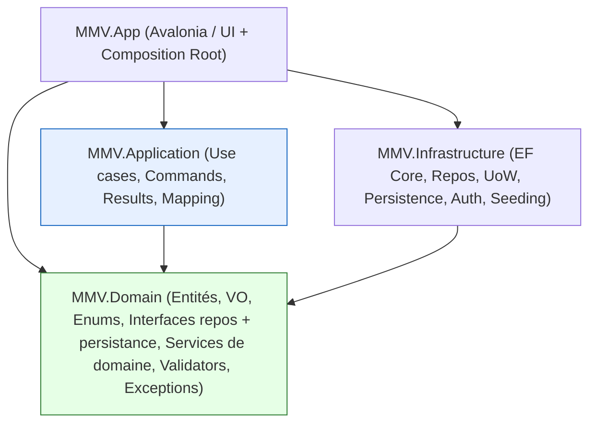

# ADR — Frontières de couches et style applicatif (P2B-2A)

> **Statut : ACCEPTÉ (cadrage P2B-2A — décision d'orientation, AUCUNE implémentation massive).**
> Cet ADR **fixe les frontières** Domain / Application / Infrastructure / UI **avant** la création de la
> couche Application (P2B-2B) et le premier vertical slice (P2B-2C). Il **ne déplace pas** de code métier et
> **ne crée pas** la couche Application : il en décide la forme, les règles de dépendances et la trajectoire
> de migration.
>
> Références : [migration-roadmap §Étape 2](migration-roadmap.md), [adr-candidates ADR-001](adr-candidates.md#adr-001),
> [risk-register R-05/R-23](risk-register.md), [dependency-map](dependency-map.md),
> [phase-1-technical-audit §4.1](phase-1-technical-audit.md), ADR P2A acceptés
> ([transaction-idempotency](adr-transaction-idempotency.md), [stock-concurrency](adr-stock-concurrency.md),
> [numbering](adr-numbering.md), [environments-seeding](adr-environments-seeding.md)).
>
> **Hors périmètre (interdits P2B-2A) :** création massive de la couche Application, vertical slice complet,
> refonte de `SaleFormViewModel`, devis, facture, fiscalité, Belgique/Maroc, organisation/magasin, SaaS,
> modèle `Money`, refonte UI. **Aucune règle métier modifiée.**

Date : 12 juin 2026. Branche : `p2b-architecture`.

---

## 1. Contexte

### 1.1 Ce que P2A a livré (vérifié dans le dépôt)

La stabilisation P2A (1C→1F, `GO définitif`) a introduit, **sans** couche Application, des **primitives
neutres** dans `MMV.Domain` (sans dépendance EF/SQLite/Avalonia), implémentées dans `MMV.Infrastructure`,
et **réutilisables telles quelles** par une future couche Application :

| Primitive (Domain) | Implémentation (Infrastructure) | Rôle |
|---|---|---|
| [`ITransactionRunner`](../../src/MMV.Domain/Interfaces/Persistence/ITransactionRunner.cs) | [`EfTransactionRunner`](../../src/MMV.Infrastructure/Persistence/EfTransactionRunner.cs) | frontière transactionnelle (commit/rollback) (P2A-1C, R-23) |
| [`IStockMutationService`](../../src/MMV.Domain/Interfaces/Persistence/IStockMutationService.cs) | [`EfStockMutationService`](../../src/MMV.Infrastructure/Persistence/EfStockMutationService.cs) | décrément de stock atomique conditionnel (P2A-1D, R-09) |
| [`INumberSequenceService`](../../src/MMV.Domain/Interfaces/Persistence/INumberSequenceService.cs) | [`EfNumberSequenceService`](../../src/MMV.Infrastructure/Persistence/EfNumberSequenceService.cs) | numérotation transactionnelle fiable (P2A-1E, R-03) |
| Exceptions contrôlées [`PersistenceException`](../../src/MMV.Domain/Exceptions/PersistenceException.cs), [`InsufficientStockException`](../../src/MMV.Domain/Exceptions/DomainExceptions.cs), [`NumberSequenceException`](../../src/MMV.Domain/Exceptions/DomainExceptions.cs) | [`PersistenceErrorMapper`](../../src/MMV.Infrastructure/Persistence/PersistenceErrorMapper.cs) | erreurs métier/techniques typées |

Chaque ADR P2A documente explicitement la **couture** prévue pour l'Étape 2 : « déplacer le corps
`PersistSaleAsync` vers un use case Application appelant le **même** runner / service ; supprimer l'accès
repo depuis la VM » (cf. [adr-transaction-idempotency §4.7](adr-transaction-idempotency.md),
[adr-stock-concurrency §4.5](adr-stock-concurrency.md), [adr-numbering §4.6](adr-numbering.md)).

### 1.2 Le risque architectural restant : R-05

Le constat **CRITICAL R-05** (« logique métier dans les ViewModels ») **reste ouvert**. Preuve actuelle
(dépôt, pas rapport) : [`SaleFormViewModel.PersistSaleAsync`](../../src/MMV.App/ViewModels/SaleFormViewModel.cs#L909-L1057)
**orchestre un cas d'utilisation métier complet** dans la couche UI :

1. attribue un `SaleNumber` (séquence `SALE`) ;
2. construit l'agrégat `Sale` + `SaleItem` (paramètres optiques OD/OG) ;
3. décide le statut (`Delivered` comptoir / `AwaitingLenses` fabrication) ;
4. persiste la vente (`SaveChanges`) pour obtenir le `SaleId` ;
5. crée, si verres, la **commande fournisseur** `Order` (séquence `ORDER`) ;
6. **décrémente le stock** (vente comptoir, hors verres) via `DecrementStockAsync` et écrit les `StockMovement` ;
7. le tout enveloppé dans `ITransactionRunner.RunAsync`.

Cette méthode dépend **directement** de 6 abstractions de persistance/domaine :
`ISaleRepository`, `IOrderRepository`, `IProductRepository`, `IStockMovementRepository`, `IUnitOfWork`,
plus `INumberSequenceService`, `IStockMutationService` et `ITransactionRunner`. **C'est exactement le futur
use case `EnregistrerVente`**, aujourd'hui dans la VM.

### 1.3 État réel des couches (cartographie vérifiée au 12 juin 2026)

| Couche | Projet | Contenu réel | Anomalie |
|---|---|---|---|
| **UI/App** | `MMV.App` | Vues `.axaml`, ViewModels (**orchestration métier**, R-05), validation d'entrée, mapping, **composition root** ([App.axaml.cs](../../src/MMV.App/App.axaml.cs)), services UI (Navigation, Dialog, Session, Permission, Theme). Les VM consomment **directement** repos + `IUnitOfWork` + primitives P2A. | V3 (logique dans UI), V6 (UI→repos) |
| **Application** | *(inexistant)* | — | V5 (couche absente) |
| **Domain** | `MMV.Domain` | Entités **anémiques**, enums, **value objects morts** (`Money`/`Address`/`Email`/`PhoneNumber`), validators FluentValidation, **services de domaine transaction-script** (`SaleService`, `OrderService`…), exceptions, **interfaces repos**, **ports de persistance** P2A. Pur : `.csproj` → aucune réf. projet, seul `FluentValidation`. | services **contournés** (non enregistrés dans App), VO morts (V7) |
| **Infrastructure** | `MMV.Infrastructure` | `OpticDbContext`, configs EF, repositories, `UnitOfWork`, **implémentations P2A** (`Persistence/`), cycle de vie SQLite (`Data/`), **seeding/config** (`Configuration/`), `AuthenticationService`. → `MMV.Domain`. | `RollbackAsync` trompeur (R-23) ; double module DI (cf. 1.4) |
| **Tests** | `MMV.Domain.Tests`, `MMV.App.Tests` | Domain.Tests = domaine **+ infrastructure** (tests vrai SQLite : `Persistence/`, `Data/`, `Configuration/`) ; App.Tests = ViewModels/services UI. **320 tests verts**. | tests de services de domaine **non utilisés en prod** |

### 1.4 Double module de DI (résidu V1/V2)

Le composition root **réel et unique** est [`App.ConfigureServices()`](../../src/MMV.App/App.axaml.cs#L105-L166).
Il enregistre `DbContext`, repos, `IUnitOfWork`, les 3 primitives P2A, `IAuthenticationService` et les
services UI — **mais PAS** les services de domaine (`SaleService`, `OrderService`, `CustomerService`,
`ProductService`, `PrescriptionService`). En parallèle,
[`Infrastructure.DependencyInjection.AddInfrastructure()`](../../src/MMV.Infrastructure/DependencyInjection.cs#L19-L64)
**enregistre** ces services de domaine **mais n'est jamais appelé** (`ABSENCE_VÉRIFIÉE` : aucun appel dans
`src/`). Conséquence : les services de domaine restent **morts au runtime** (utilisés seulement par les
tests). Ce résidu de la double DODI (V1/V2 de l'audit) sera **assaini** lors de la migration (cf. §10).

### 1.5 Direction de la décision (imposée par la roadmap)

La [roadmap §Étape 2](migration-roadmap.md) et [ADR-001 option 5](adr-candidates.md#adr-001) imposent
l'orientation : **introduire une couche Application progressive (use cases / services applicatifs simples),
interdire l'accès repo depuis les VM, unifier la DI**, en **réutilisant** les primitives P2A, **sans big
bang** et **sans dépendance Avalonia/EF** dans Domain et Application.

---

## 2. Décision

**Créer une couche Application progressive `MMV.Application`** (nouveau projet `classlib net8.0`),
organisée en **use cases / services applicatifs simples** (un cas d'utilisation = une unité explicite),
**structurée pour rester compatible avec un CQRS léger ultérieur** (Command + Handler), migrée par
**strangler pattern** (un parcours à la fois, produit toujours fonctionnel), **sans** refonte big-bang et
**sans** aucune dépendance Avalonia/EF.

> **P2B-2A décide ; P2B-2B crée le projet et le premier use case ; P2B-2C livre le vertical slice.**
> Le présent ADR **ne crée pas** le projet `MMV.Application`.

### 2.1 Style applicatif retenu

- **Use cases / services applicatifs simples** : une classe par cas d'utilisation (`RegisterSaleUseCase`)
  **ou** un service applicatif cohérent par agrégat (`SaleAppService`), exposant des méthodes à intention
  métier explicite. Pas de framework de médiation (pas de MediatR) à ce stade.
- **Compatibilité CQRS léger** : chaque use case prend un **objet d'entrée** (`Command`/`Query`) et renvoie
  un **objet de sortie** (`Result`) ⇒ on pourra, plus tard et sans rupture, scinder en
  `Command`/`CommandHandler` (et introduire un dispatcher) si le volume le justifie.
- **Transaction script assumé comme étape** : les premiers use cases resteront proches d'un transaction
  script (orchestration explicite). C'est **acceptable** comme palier ; l'enrichissement du modèle de
  domaine (entités moins anémiques, VO `Money`) viendra par lots ultérieurs (Étapes 3/4), **hors P2B**.

---

## 3. Options comparées (exigées par la phase)

| # | Option | Avantages | Inconvénients | Verdict |
|---|---|---|---|---|
| **1** | **Garder la logique dans les ViewModels** (statu quo R-05) | aucun coût immédiat ; pas de couche en plus | R-05 non clos ; logique **non réutilisable, non testable hors UI** ; couplage UI↔persistance ; bloque la variabilité nationale (ADR-001) ; chaque parcours futur reproduit le problème | **Rejeté** (cause du risque) |
| **2** | **Services de domaine appelés directement par l'UI** (`SaleService` & co. branchés dans la DI) | réutilise l'existant ; rapproche du domaine | les services de domaine actuels sont des **transaction scripts couplés à `IUnitOfWork`**, **incomplets** (`SaleService.CreateSaleAsync` ne gère ni commande, ni stock, ni transaction) ; mélange orchestration applicative et règles ; mauvais réceptacle pour politiques nationales/horloge/mapping ; l'UI dépendrait encore d'abstractions de persistance | **Rejeté** (réceptacle inadéquat) |
| **3** | **Couche Application avec services applicatifs simples / use cases** | sépare **orchestration** (Application) et **règles** (Domain) ; **réutilise** les primitives P2A inchangées ; testable hors UI ; réceptacle naturel des politiques datées (ADR-001) ; **migration incrémentale** possible | introduit un projet + une discipline de mapping ; nécessite d'unifier la DI | **RETENU** |
| **4** | **CQRS léger (Commands/Handlers + dispatcher)** d'emblée | séparation lecture/écriture nette ; extensible | **sur-ingénierie** pour un desktop mono-poste actuel ; coût d'apprentissage ; dépendance de médiation prématurée ; n'apporte rien tant que le volume de use cases est faible | **Différé** (l'option 3 y reste **compatible** : évolution sans rupture) |
| **5** | **Vertical slices complets** (feature folders bout-en-bout) | cohésion par fonctionnalité ; bon pour le SaaS | nécessite déjà la couche Application **et** les fondations (org/magasin, monétaire) ; risque de duplication transverse ; trop large pour un cadrage | **Différé** (le **premier** slice est P2B-2C, après P2B-2B) |
| **6** | **Clean Architecture stricte** (ports & adapters complets, entités riches, mapping total, zéro fuite EF) | cible idéale à long terme | **big-bang** incompatible avec « pas de refonte massive » ; impose simultanément entités riches + `Money` + mapping complet ; risque de blocage et de régressions | **Rejeté comme palier** (cible asymptotique, atteinte par lots, pas en une étape) |

**Justification (option 3).** C'est l'orientation **pragmatique** exigée : elle ferme R-05 **progressivement**,
**réutilise** exactement les coutures que P2A a préparées (mêmes `ITransactionRunner` /
`IStockMutationService` / `INumberSequenceService`), **n'enferme rien** dans Avalonia/EF, reste **compatible**
avec le CQRS léger (4) et la Clean Architecture stricte (6) comme **évolutions** plutôt que big-bang, et
permet de livrer un **premier vertical slice** (5) une fois le projet créé (P2B-2C).

---

## 4. Frontières et règles de dépendances cibles

### 4.1 Graphe de dépendances cible

### 4.2 Règles de dépendances (invariants)

1. `MMV.Domain` **ne référence aucun projet** et **aucun** package EF/Avalonia (statu quo à préserver ;
   vérifié dans le `.csproj` : seul `FluentValidation`).
2. `MMV.Application` **→ `MMV.Domain` uniquement**. **Interdits** : `Microsoft.EntityFrameworkCore`,
   `Microsoft.Data.Sqlite`, `Avalonia*`, `CommunityToolkit.Mvvm`, `MMV.Infrastructure`, `MMV.App`.
3. `MMV.Infrastructure` **→ `MMV.Domain`** (implémente les interfaces repos + persistance). **Ne référence
   pas** `MMV.Application` tant qu'aucun port défini *dans* Application n'est requis par l'Infrastructure
   (aujourd'hui : aucun).
4. `MMV.App` **→ `MMV.Domain`, `MMV.Application`, `MMV.Infrastructure`** : **seul** lieu autorisé à connaître
   les types **concrets** d'Infrastructure (composition root). Les VM ne référencent **que** `MMV.Application`
   (use cases) et `MMV.Domain` (entités/DTO/enums) — **plus** `MMV.Infrastructure.Repositories`/`Data`.
5. **Sens des dépendances** : UI → Application → Domain ← Infrastructure. Aucune flèche ne remonte vers l'UI.
6. **Cible de migration** : **plus aucun** `I*Repository` / `IUnitOfWork` / `SaveChangesAsync` /
   `ITransactionRunner` consommé **directement** par un ViewModel ; tout passe par un use case Application.

### 4.3 Où vivent les abstractions de persistance (ports P2A)

Les ports `ITransactionRunner`, `IStockMutationService`, `INumberSequenceService` et les interfaces
`I*Repository`/`IUnitOfWork` **restent dans `MMV.Domain.Interfaces`** (statu quo). Justification pragmatique :
ils y sont **déjà**, **testés**, **neutres** (sans EF), et consommables par `MMV.Application` qui référence
`MMV.Domain`. **Aucun déplacement** n'est requis ni souhaité en P2B (éviter le churn). Une éventuelle
relocalisation vers `MMV.Application` (« ports » côté use cases) reste possible plus tard sans rupture, mais
n'est **pas** décidée ici.

---

## 5. Répartition des responsabilités (qui fait quoi)

| Préoccupation | Domain | Application | Infrastructure | UI/App |
|---|---|---|---|---|
| **Entités & invariants métier** | ✅ (entités, à enrichir par lots) | — (orchestre) | — (mappe en tables) | — |
| **Value objects** (`Money` futur) | ✅ | consomme | mapping EF | affichage |
| **Règles métier pures** (calculs, contraintes) | ✅ (services de domaine **assainis** / entités) | invoque | — | — |
| **Orchestration d'un cas d'utilisation** (vente = numéro + agrégat + commande + stock) | — | ✅ **use case** | — | délègue |
| **Frontière transactionnelle** | port `ITransactionRunner` | **ouvre** la transaction (appelle le runner) | implémente (`EfTransactionRunner`) | — |
| **Accès aux données** | interfaces repos | consomme les repos | implémente repos/`UoW`/`DbContext` | — |
| **Numérotation / décrément stock** | ports | invoque dans la transaction | implémente (CAS / update conditionnel) | — |
| **Validation d'entrée** (champs requis, formats UI) | — | — | — | ✅ ViewModel |
| **Validation de commande** (préconditions du use case) | règles invoquées | ✅ (FluentValidation côté Application) | — | — |
| **Invariants de domaine** (montant ≥ 0, remise ≤ total…) | ✅ | déclenche | — | — |
| **Mapping** ViewModel→Command, Command→entités, résultat→Result | — | ✅ (Command/entités, entités/Result) | — | ✅ (état VM ↔ Command/Result) |
| **Erreurs métier typées** (`InsufficientStock`, `BusinessRule`, `NumberSequence`) | ✅ (définit) | propage / produit `Result` | lève via primitives | ✅ (mappe en message) |
| **Erreurs techniques** (`PersistenceException`) | ✅ (type) | laisse remonter | ✅ (mappe EF/SQLite) | ✅ (mappe en message) |
| **Composition root / DI** | — | — | (module DI optionnel) | ✅ unique |
| **Services UI** (navigation, dialog, session, permission, theme) | — | — | — | ✅ |
| **Autorisation** (authz) | (cible : politique réutilisable) | (point d'application futur) | — | ⚠️ aujourd'hui UI-only (hors P2B) |

### 5.1 Ce qui **reste** dans Domain
Entités, value objects, enums, **interfaces** (repos + persistance), exceptions métier, validators, services
de domaine (**purs**, assainis : règles sans orchestration de persistance multi-étapes). Domain **reste pur**.

### 5.2 Ce qui **va** dans Application
Use cases / services applicatifs (orchestration), objets `Command`/`Query` (entrée) et `Result` (sortie),
mapping commande↔domaine, validation de commande, et l'**ouverture de la transaction** (via le port runner).
**Aucun** type EF/Avalonia.

### 5.3 Ce qui **reste** dans Infrastructure
`OpticDbContext`, configurations EF, repositories, `UnitOfWork`, implémentations des ports P2A, cycle de vie
SQLite, seeding/config, `AuthenticationService`. **Assainissement** différé de `UnitOfWork.RollbackAsync`
(R-23) une fois les flux migrés.

### 5.4 Ce qui **reste** dans UI
Vues, ViewModels (état + interaction + validation d'entrée + mapping VM↔Command/Result), services UI,
composition root. Les VM **délèguent** l'orchestration aux use cases et **cessent** d'accéder aux repos.

---

## 6. Gestion des transactions

- **Inchangée dans son mécanisme** : le port `ITransactionRunner` (P2A-1C) reste la frontière unique.
- **Déplacement de l'appelant** : l'ouverture de la transaction passe **de la ViewModel au use case**
  Application. Le use case `EnregistrerVente` appellera `ITransactionRunner.RunAsync(…)` ; les
  `INumberSequenceService`/`IStockMutationService`/repos **partagent le même `DbContext` de portée** et
  participent donc à la transaction (exactement comme aujourd'hui, mais piloté par Application).
- **Une transaction = un use case** : la frontière transactionnelle coïncide avec la frontière du cas
  d'utilisation. Pas de transaction ouverte dans l'UI, pas de `SaveChangesAsync` dans l'UI.
- **R-23** : `UnitOfWork.RollbackAsync` (dispose ≠ rollback) reste **contourné** ; son assainissement/retrait
  est planifié quand plus aucun flux ne l'utilise (cf. plan de migration §critères).

---

## 7. Gestion des repositories

- **Interfaces** dans Domain, **implémentations** dans Infrastructure : **inchangé**.
- **Consommateur** : les repos sont consommés par les **use cases Application**, **plus** par les VM.
- **Lecture vs écriture** : à court terme, les use cases d'écriture passent par les repos + `ITransactionRunner` ;
  les **lectures** d'affichage peuvent rester via des use cases de requête (`Query`) renvoyant des `Result`
  (DTO). Le sur-fetching d'`Include` et le filtrage en mémoire (audit §4.8) ne sont **pas** traités en P2B
  (perf différée), mais ne **doivent pas** être aggravés.
- **Pas de fuite d'`IQueryable`/`DbContext`** vers l'UI ni vers le Domain.

---

## 8. Gestion des erreurs

Trois familles, déjà amorcées par P2A, **conservées** :

1. **Erreurs métier contrôlées** — hiérarchie `DomainException` (Domain) : `BusinessRuleException`,
   `InsufficientStockException`, `NumberSequenceException`, `EntityNotFoundException`, `DuplicateEntityException`.
   Produites/propagées par les use cases ; **non** transformées par le runner.
2. **Erreurs techniques contrôlées** — `PersistenceException` + `PersistenceErrorMapper` (Infrastructure) :
   EF/SQLite (unicité, contrainte, base occupée/inaccessible) → message assaini ; détail en `InnerException`.
3. **Résultat métier explicite** — chaque use case renvoie un **objet `Result`** décrivant le succès
   (entité créée, numéro attribué…). **Convention P2B retenue (pragmatique)** : succès via `Result`,
   **échecs métier/techniques via exceptions typées** (déjà attrapées par les VM aujourd'hui). Un
   `Result<T>` enrichi (succès **et** échec encapsulés, sans exception pour le flux nominal d'erreur métier)
   reste une **évolution compatible** ultérieure ; non imposé en P2B pour limiter le churn.
- **UI** : les VM mappent exceptions/résultat en `ErrorMessage`/notification (comme aujourd'hui).
- **Aucune** exception avalée ; le mapping contrôlé P2A est **préservé**.

---

## 9. Gestion des validations

Trois niveaux **non redondants** (ne pas valider la même règle deux fois) :

1. **Validation d'entrée (UI)** : champs requis, formats, panier non vide — **reste dans les ViewModels**
   (présentation). Ex. actuel : `ExecuteSave` vérifie `OrderItems.Count == 0`.
2. **Validation de commande (Application)** : préconditions du use case (cohérence de la `Command`, entités
   référencées existantes, quantités positives) — **dans la couche Application**, en réutilisant
   **FluentValidation** (déjà présent dans Domain) ou des gardes explicites.
3. **Invariants de domaine (Domain)** : règles métier dures (remise ≤ total, montant ≥ 0, statut valide) —
   **dans le Domain** (services/entités). Ex. existant à réutiliser : `SaleService.CalculateSaleAsync`
   (`BusinessRuleException` si remise négative / supérieure au total).

**Règle d'or** : une règle a **un seul propriétaire de couche**. La validation d'entrée ne duplique pas
l'invariant de domaine ; elle le **prévient** ergonomiquement.

---

## 10. Mapping DTO / ViewModel / Command

- **VM → Command** : la ViewModel transforme son **état** (champs liés à l'UI) en une `Command`
  d'Application (`RegisterSaleCommand { CustomerId, Lines[], Discount, Deposit, PaymentMethod, IsCounterSale, … }`).
- **Command → Domain** : le use case construit/charge les **entités** (`Sale`, `SaleItem`, `Order`,
  `StockMovement`) — la logique aujourd'hui dans `PersistSaleAsync`.
- **Domain → Result** : le use case renvoie un `Result` (DTO) : identifiants, numéros attribués, statut.
- **Result → VM** : la ViewModel met à jour son état/affichage à partir du `Result`.
- **Cible** : ne **pas** exposer d'entités EF persistées directement à l'UI **à terme** ; pendant la
  migration, des entités peuvent transiter (toléré, documenté), sans `DbContext`/`IQueryable`.

---

## 11. Stratégie de test

| Cible | Aujourd'hui | Après couche Application |
|---|---|---|
| **Use cases Application** | inexistant | tests **isolés** : (a) **vrai SQLite** (intégration transactionnelle, comme `EfTransactionRunnerTests`/`EfStockMutationServiceTests`/`EfNumberSequenceServiceTests`) ; (b) ports mockés (Moq) pour les chemins d'erreur |
| **ViewModels** | testent l'orchestration (`SaleFormViewModelTransactionTests`…) | tests **réduits** à la présentation (état, garde `IsSaving`, mapping VM↔Command, affichage d'erreur) ; délégation au use case **vérifiée** (spy) |
| **Domain** | validators / services / VO | inchangé ; règles de domaine testées au plus près |
| **Infrastructure** | repos / persistance / lifecycle | inchangé |
| **Non-régression** | 320 tests verts | **maintenue** à chaque migration de parcours (le parcours reste utilisable) |

Principes : **vrai SQLite** (jamais InMemory) pour la persistance ; **horloge injectable** introduite avec
les fondations (Étape 4) pour des tests temporels déterministes — **hors P2B**.

---

## 12. Migration progressive (résumé ; détail dans le plan dédié)

[`application-layer-migration-plan.md`](application-layer-migration-plan.md) détaille l'ordre et la stratégie.
Synthèse :

1. **P2B-2B** — créer `MMV.Application` (projet + dossiers + règles de dépendances) + **DI unifiée**
   (supprimer le résidu `AddInfrastructure` mort ou le rebrancher proprement) ; **aucun** changement de
   comportement utilisateur.
2. **P2B-2C** — **premier vertical slice** : use case `EnregistrerVente` extrait de `PersistSaleAsync`,
   réutilisant les **mêmes** primitives ; `SaleFormViewModel` **délègue** ; suppression de l'accès repo de
   ce flux.
3. **P2B-2D…2I** — migrer **un parcours par étape** (Vente, Commandes, Stock, Client, Ordonnances, Atelier),
   chacun restant utilisable (**strangler**, pas big-bang).

---

## 13. Conséquences

**Positives** : R-05 adressable **progressivement** ; logique métier **testable hors UI** et **réutilisable** ;
réceptacle prêt pour politiques nationales datées (ADR-001), horloge (ADR-005), monétaire (ADR-004) **sans
les coder ici** ; coutures P2A réutilisées telles quelles ; chemin compatible CQRS léger / Clean stricte.

**Négatives / dette assumée** : un projet et une discipline de mapping en plus ; pendant la migration,
coexistence temporaire VM-orchestration / use cases (par parcours) ; `UnitOfWork.RollbackAsync` (R-23) et les
VO morts restent à assainir ultérieurement ; entités encore anémiques (enrichissement par lots, hors P2B).

---

## 14. Risques résiduels (hors périmètre, documentés)

1. **R-05 non encore clos** — la décision cadre la fermeture ; l'exécution est P2B-2B/2C+. 
2. **Double DI (V1/V2)** — `AddInfrastructure` mort ; **à assainir** en P2B-2B (DI unifiée).
3. **R-23** — `UnitOfWork.RollbackAsync` trompeur ; assainissement après migration des flux.
4. **VO morts / entités anémiques (V7, 4.2)** — non traités en P2B ; relèvent du modèle monétaire (Étape 3)
   et de l'enrichissement du domaine (lots ultérieurs).
5. **Perf (over-fetching, filtrage mémoire — audit §4.8)** — non aggravée, non traitée en P2B.
6. **Autorisation UI-only** — non traitée ; point d'application futur dans Application/Domain (Programme 3/7).
7. **`CS1998`** résiduel ([OrderFormViewModel.cs:458](../../src/MMV.App/ViewModels/OrderFormViewModel.cs#L458))
   — hygiène, hors périmètre.

Aucun de ces risques ne touche au réglementaire ni aux interdictions de la phase. **Aucune valeur de gate
(TVA, devise, barème) n'est introduite.**
