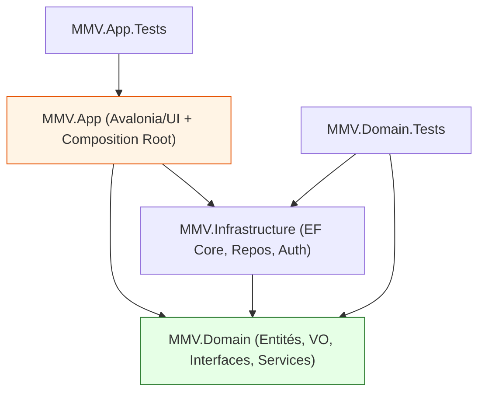
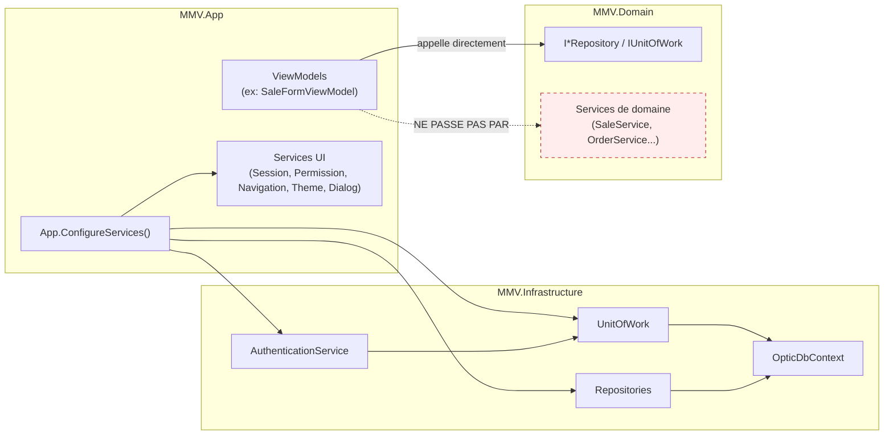

# Carte de dépendances — MMV (Phase 1)

> Reconstruite à partir des `.csproj`, du composition root et des `using` réellement présents au 9 juin 2026. Aucune modification de code.

## 1. Projets et types

| Projet | SDK / Type | TargetFramework | Rôle |
|---|---|---|---|
| `MMV.Domain` | classlib | net8.0 | Entités, value objects, enums, interfaces de repositories, services de domaine, validators, exceptions |
| `MMV.Infrastructure` | classlib | net8.0 | `OpticDbContext`, configurations EF, repositories, `UnitOfWork`, seed, `AuthenticationService` |
| `MMV.App` | WinExe (Avalonia) | net8.0 | Vues `.axaml`, ViewModels, services UI (navigation, dialog, session, permission, theme), composition root |
| `MMV.Domain.Tests` | xUnit | net8.0 | Tests domaine + infrastructure |
| `MMV.App.Tests` | xUnit | net8.0 | Tests ViewModels et services UI |

## 2. Références entre projets (vérifiées dans les `.csproj`)

```
MMV.Domain            → (aucune référence projet)        [NuGet: FluentValidation]
MMV.Infrastructure    → MMV.Domain                        [NuGet: EFCore.Sqlite, EFCore.Design, BCrypt.Net-Next, Config.Abstractions]
MMV.App               → MMV.Domain, MMV.Infrastructure    [NuGet: Avalonia*, CommunityToolkit.Mvvm, MS.DI, MS.Hosting, FluentAvaloniaUI, Projektanker.Icons]
MMV.Domain.Tests      → MMV.Domain, MMV.Infrastructure    [NuGet: xunit, FluentAssertions, Moq, EFCore.Sqlite]
MMV.App.Tests         → MMV.App                           [NuGet: xunit, Moq, coverlet]
```

## 3. Diagramme de dépendances projet



**Lecture :** au niveau des références projet, la direction est correcte (tout pointe vers `Domain`, `Domain` ne dépend de rien). Le point d'attention (`App` en orange) tient à l'usage réel des dépendances, pas à la topologie (cf. §5).

## 4. Flux de dépendances au runtime (composition root)



- `App.ConfigureServices()` enregistre `DbContext`, repositories, `UnitOfWork`, `IAuthenticationService`, services UI et ViewModels.
- **Les services de domaine (`SaleService`, `OrderService`, `CustomerService`, `ProductService`, `PrescriptionService`) ne sont PAS enregistrés** dans la DI réelle ([App.axaml.cs:111-146](../../src/MMV.App/App.axaml.cs#L111-L146)).
- Les ViewModels consomment directement `IUnitOfWork`/`I*Repository`.

## 5. Violations et anomalies observées

| # | Anomalie | Preuve | Conséquence |
|---|---|---|---|
| V1 | **Double configuration DI divergente** | [`App.ConfigureServices`](../../src/MMV.App/App.axaml.cs#L102-L169) vs [`AddInfrastructure`](../../src/MMV.Infrastructure/DependencyInjection.cs#L17-L51) | la « bonne » DI (avec services) est morte |
| V2 | **`AddInfrastructure` jamais appelé** | `Grep "AddInfrastructure"` → définition + docs uniquement | services de domaine inutilisés |
| V3 | **Logique métier dans la couche UI** | [SaleFormViewModel.cs:809-980](../../src/MMV.App/ViewModels/SaleFormViewModel.cs#L809-L980) | règles non réutilisables, non testées, fuites cross-couche |
| V4 | **2 chemins physiques de BD distincts sur 4 sites de configuration** (corrigé Phase 1B) | relatif `mmv-optic.db` ([App.axaml.cs:108](../../src/MMV.App/App.axaml.cs#L108)) **vs** `%LOCALAPPDATA%\ManageMyVision\mmv.db` (présent dans 3 sites : [OpticDbContext.cs:122-126](../../src/MMV.Infrastructure/Data/OpticDbContext.cs#L122-L126), [OpticDbContextFactory.cs:16-19](../../src/MMV.Infrastructure/Data/OpticDbContextFactory.cs#L16-L19), [DependencyInjection.cs:66-78](../../src/MMV.Infrastructure/DependencyInjection.cs#L66-L78) non appelé) ; 2 chaînes de connexion distinctes | migrations appliquées sur une autre base que le runtime |
| V5 | **Absence de couche Application** | services de domaine couplés à `IUnitOfWork` ([SaleService.cs:21-26](../../src/MMV.Domain/Services/SaleService.cs#L21-L26)) | mélange orchestration/règles ; difficile d'insérer des politiques nationales |
| V6 | **UI → Infrastructure (concret) au-delà du composition root** | `MMV.App` référence `MMV.Infrastructure.Repositories`/`Data`/`Services` ([App.axaml.cs:12-14](../../src/MMV.App/App.axaml.cs#L12-L14)) | acceptable pour la racine, mais combiné à V2/V3 le contournement devient structurel |
| V7 | **Value objects orphelins** | `Money`/`Address`/`Email`/`PhoneNumber` jamais instanciés dans `src/` | intentions DDD non réalisées |

## 6. Dépendances NuGet (versions observées)

| Package | Version | Projet |
|---|---|---|
| FluentValidation | 11.9.0 | Domain |
| Microsoft.EntityFrameworkCore.Sqlite | 8.0.0 | Infrastructure, Domain.Tests |
| Microsoft.EntityFrameworkCore.Design | 8.0.0 | Infrastructure, App |
| BCrypt.Net-Next | 4.0.3 | Infrastructure |
| Microsoft.Extensions.Configuration.Abstractions | 8.0.0 | Infrastructure |
| Avalonia (+ Desktop, DataGrid, Themes.Fluent, Fonts.Inter, Diagnostics) | 11.2.8 | App |
| FluentAvaloniaUI | 2.1.0 | App |
| CommunityToolkit.Mvvm | 8.2.2 | App |
| Microsoft.Extensions.DependencyInjection | 8.0.0 | App |
| Microsoft.Extensions.Hosting | 8.0.0 | App |
| Projektanker.Icons.Avalonia | 9.6.2 | App |
| xunit | 2.6.6 (Domain.Tests) / 2.5.3 (App.Tests) | Tests |
| FluentAssertions | 6.12.0 | Domain.Tests |
| Moq | 4.20.70 / 4.20.72 | Tests |
| Microsoft.NET.Test.Sdk | 17.9.0 / 17.8.0 | Tests |
| coverlet.collector | 6.0.0 | App.Tests |

> Versions de test **non homogènes** entre les deux projets (xunit 2.6.6 vs 2.5.3, Test.Sdk 17.9 vs 17.8, Moq 4.20.70 vs 4.20.72) — à uniformiser (idéalement via `Directory.Packages.props`, absent : `ABSENCE_VÉRIFIÉE_PAR_RECHERCHE_DU_DÉPÔT`).

## 7. Recommandation de cible (sans implémentation)

Direction cible à discuter en ADR :
- Introduire une **couche Application** (use cases) entre UI et Domain, recevant les politiques nationales.
- Faire transiter **toute** écriture par cette couche (suppression de l'accès repo depuis les VM).
- **Un seul** composition root et **une seule** source de chaîne de connexion.
- Détails et options : [`adr-candidates.md`](adr-candidates.md).
