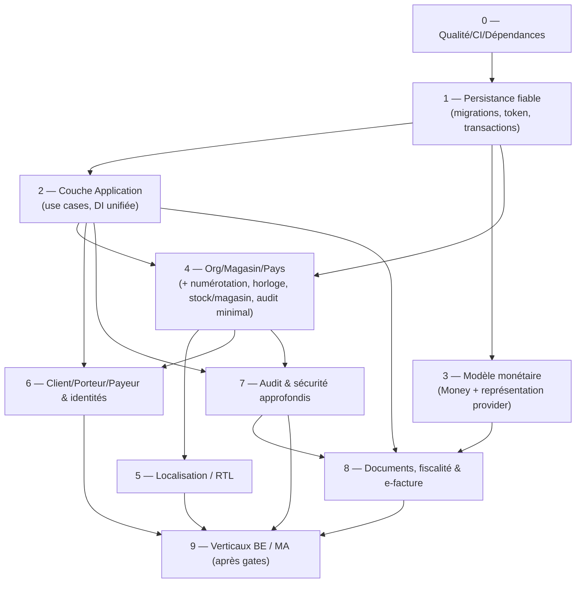

# Feuille de route de migration — MMV (Phase 1, révisée Phase 1B)

> Roadmap **progressive, sans code**. Elle respecte les dépendances réelles entre constats du [registre des risques](risk-register.md) et les fondations A de la Phase 0.5D. **Aucune valeur réglementaire n'est codée** ; les gates restent externes.
>
> **Révision Phase 1B :** correction des contradictions de dépendances (la couche Application précède désormais les use cases transactionnels ; le vertical slice est placé après les fondations qu'il requiert), **séparation des lots** (i18n/RTL, client/porteur/payeur, facturation/fiscalité, audit/sécurité ne sont plus un même lot horizontal), fiscalité exprimée en **cycle de vie d'états** (ADR-011), et stratégie de **rollback** distinguant cinq mécanismes.

## 1. Principes directeurs

1. **Stabiliser avant d'étendre** : qualité au vert (tests, CI), persistance fiable, puis fondations métier.
2. **Respecter les dépendances** : ne pas introduire de use case transactionnel avant la couche Application ; ne pas livrer un vertical avant ses fondations.
3. **Lots ciblés, pas d'étapes horizontales fourre-tout** : chaque capacité (i18n, identités, fiscalité, audit) a sa propre dépendance et peut être livrée séparément.
4. **Compatibilité ascendante** : chaque étape conserve un produit fonctionnel ; pas de « big bang ».
5. **Données existantes non inventées** : ne jamais fabriquer pays/devise/identifiant manquants — valeur explicite ou « inconnu » tracé.
6. **Les gates sont des paramètres** : on construit la capacité de les recevoir, jamais leurs valeurs.

## 2. Prérequis (avant toute étape)

| Prérequis | Pourquoi | Référence |
|---|---|---|
| Suite de tests verte | filet de sécurité du refactoring | R-10 |
| CI build+test+scan obligatoire | empêcher la régression ; détecter les vulnérabilités | R-10, R-22, R-24 |
| `global.json` + versions packages homogènes | builds reproductibles | R-22 |
| Décision ADR-003 (source de vérité du schéma + **déclencheur** de migration + rollback) | toute évolution de schéma en dépend ; le déclencheur n'est pas imposé | R-04 |
| Inventaire des bases existantes (`EnsureCreated`) + sauvegarde | plan de reprise/restauration des données | R-04 |

## 3. Ordre des changements (étapes)

### Étape 0 — Stabilisation qualité & dépendances *(prérequis, effort S-M)*
- Réparer les 5 tests rouges (aligner la stratégie de seed, fixtures Product/Supplier).
- Ajouter une CI (restore/build/test) + `global.json` + uniformisation des versions de test.
- **Mettre à jour les packages transitifs vulnérables** (R-24) et intégrer le scan `--vulnerable` au CI.
- Nettoyer fichiers/vues obsolètes (R-21).
- **Critère de sortie** : `dotnet test` 100 % vert en CI ; 0 vulnérabilité High non traitée.
- **Rollback** : aucune donnée touchée (outillage/tests).

### Étape 1 — Socle de persistance fiable *(BLOCKER, effort M-L)* — dépend de 0
- Décider et appliquer ADR-003 : **migrations = source de vérité**, suppression d'`EnsureCreated`, **chemin DB unique**, **déclencheur de migration choisi** (démarrage / outil dédié / installeur / pipeline — pas imposé).
- Introduire un **concurrency token** (ADR-010, pas un `RowVersion` SQL Server) et des **transactions à la frontière d'écriture** (assainir `UnitOfWork`, R-23) — *au niveau primitive de transaction, avant l'existence des use cases*.
- Corriger les valeurs par défaut figées (R-19).
- **Compatibilité/données** : reprise des bases `EnsureCreated` existantes (script idempotent, **sauvegarde préalable vérifiée**).
- **Critère de sortie** : schéma piloté par migrations, une seule source de connexion, tests de migration + de concurrence verts.
- **Rollback** : cf. §6 (sauvegarde + forward-fix ; `Down()` non garant des données).

### Étape 2 — Couche Application & logique hors UI *(CRITICAL, effort L)* — dépend de 1
- Introduire des **use cases** (couche Application) ; **interdire l'accès repo depuis les VM** (R-05).
- **DI unifiée** (supprimer la double DI ; brancher/réintroduire les services), R-05/V1-V2.
- Migrer `ExecuteSave` vers un **use case transactionnel** (vente + commande + stock atomiques), s'appuyant sur la primitive de transaction de l'Étape 1.
- **Critère de sortie** : le chemin de vente réel est testé ; plus aucun `SaveChangesAsync` dans les VM.
- **Rollback** : feature flag par écran ; bascule progressive VM→use case.

### Étape 3 — Modèle monétaire fiable *(BLOCKER, effort M-L)* — dépend de 1 (bénéficie de 2)
- Brancher un VO `Money` au **domaine** ; choisir la **représentation en base selon ADR-004** (unités mineures entières **ou** TEXT canonique sous SQLite — **pas forcément des colonnes `decimal`**) ; devise explicite par document.
- Migration des montants `REAL`→ représentation retenue (conversion contrôlée, vérification d'écarts, contrôle d'intégrité avant/après).
- **Critère de sortie** : aucun montant en `REAL` ; chaque montant porte une devise ; tests d'arrondi/agrégation.
- **Rollback** : cf. §6 (sauvegarde + comparaison de totaux avant/après).

### Étape 4 — Fondations Organisation / Magasin / Pays *(BLOCKER, effort XL)* — dépend de 1, 2
- Introduire `Organisation`, `Magasin`, `Pays`, rattachement utilisateur, **isolation** (ADR-002, R-01).
- **Numérotation transactionnelle** par org/magasin/exercice (ADR-006, R-03).
- **Horloge injectable + fuseaux** (ADR-005, R-15).
- **Stock par magasin** (R-20 ; aujourd'hui global).
- **Primitive d'audit minimale** (journalisation des écritures clés) — socle réutilisé par l'Étape 7.
- **Données existantes** : rattacher le mono-site à une organisation/magasin « par défaut » **explicite** (pays/devise renseignés, jamais devinés).
- **Critère de sortie** : toutes les écritures portent org/magasin ; numérotation concurrente unique ; tests d'isolation.
- **Rollback** : organisation par défaut unique = retour mono-site.

### Étape 5 — Localisation / RTL *(CRITICAL, effort L)* — dépend de 4 (culture par magasin), largement parallélisable
- Externaliser les 606 littéraux (ADR-008) ; `FlowDirection` piloté par culture ; recherche latin/arabe normalisée.
- **Critère de sortie** : UI commutable FR/NL/DE/AR (selon `L-1`) ; RTL validé sur les écrans.
- **Rollback** : ressources par défaut FR.

### Étape 6 — Client / Porteur / Payeur & identités *(HIGH, effort L)* — dépend de 2, 4
- Séparer **Client / Porteur / Payeur** ; **typer les identifiants nationaux** (remplacer `SocialSecurityNumber` string) ; structurer **organisme/régime** (remplacer `InsuranceName` libre) ; ajouter **pays** sur l'adresse.
- **Critère de sortie** : identités/organismes structurés ; tests de modèle.
- **Rollback** : modèle additif (nouvelles colonnes, anciennes conservées le temps de la bascule).

### Étape 7 — Audit & sécurité approfondis *(CRITICAL, effort L)* — dépend de 2, 4
- **Journal d'audit immuable** + **trace d'accès aux données de santé** + suppression logique/rétention (ADR-009, R-08, R-12).
- Durcissement authentification : verrouillage/temporisation, rotation forcée du mot de passe initial (R-17, R-26), `RandomNumberGenerator` (R-18).
- Chiffrement au repos selon le modèle de déploiement.
- **Critère de sortie** : accès aux données de santé tracé ; tests de sécurité ; durcissement vérifié.
- **Rollback** : activation par configuration ; journal additif.

### Étape 8 — Documents, fiscalité & e-facturation *(CRITICAL, effort L-XL)* — dépend de 3, 2, 7
- Modèle **Facture** structuré + représentation PDF + connecteurs découplés (ADR-007).
- **Configuration fiscale en cycle de vie d'états** (ADR-011 : `NotConfigured`/`Configured`/`InvalidOrExpired`) ; **émission d'un document fiscal définitif conditionnée à `Configured`** ; sinon brouillon/simulation/test avec politique fictive. **Aucune valeur de taux codée** (gates `G-TVA-*`).
- **Critère de sortie** : facture B2C paramétrable ; points d'extension B2B/Peppol et remboursements ; émission définitive bloquée hors `Configured`.
- **Rollback** : modules activables par marché ; aucune règle non confirmée codée.

### Étape 9 — Verticaux pays *(P0 BE / P0 MA, après gates)* — dépend de 5, 6, 7, 8
- BE : mutualité structurée, attestation de délivrance, règles INAMI versionnées (éligibilité, 2/5 ans, ≥0,5 D), barèmes 2026 importables, B2B/Peppol selon périmètre.
- MA : facture paramétrable (ICE), AMO/régimes datés (sans figer CNOPS/CNSS hors calendrier loi 54.23), dossier de remboursement générique, FR/AR-RTL, CNDP.
- **Les valeurs restent bloquées par leurs gates** ; seule la capacité est implémentée.

## 4. Carte des dépendances entre étapes (révisée)

## 5. Stratégie de tests par étape

| Étape | Tests ajoutés |
|---|---|
| 0 | réparation suite existante ; CI ; scan vulnérabilités |
| 1 | migration (up/forward-fix), transaction, **concurrence (concurrency token + `DbUpdateConcurrencyException`)** |
| 2 | use cases (vente atomique), non-régression VM, suppression de l'accès repo |
| 3 | arrondi/agrégation monétaire, conversion `REAL`→ représentation cible, intégrité des totaux |
| 4 | isolation tenant, **unicité de numérotation concurrente**, fuseaux (horloge mockée), stock par magasin |
| 5 | localisation/RTL, recherche latin/arabe |
| 6 | modèle Client/Porteur/Payeur, typage des identifiants nationaux |
| 7 | trace d'accès aux données de santé, verrouillage/rotation, suppression logique |
| 8 | moteur fiscal **paramétré** (jamais de valeur réelle), états `NotConfigured/Configured/Invalid`, blocage d'émission hors `Configured`, modèle facture |
| 9 | politiques BE/MA **avec données de test** (gates simulés), jamais de valeur officielle codée |

## 6. Stratégie de rollback (révisée Phase 1B)

`Down()` **n'est pas** le mécanisme principal de restauration des données. Distinguer **cinq mécanismes** complémentaires :

1. **Rollback de code** — revenir à une version applicative antérieure.
2. **Rollback de schéma** (`Down()`) — DDL inverse ; **ne restaure pas** les données transformées/supprimées.
3. **Restauration des données** — depuis une **sauvegarde vérifiée**.
4. **Migration corrective vers l'avant** (forward-fix) — souvent préférable en production.
5. **Restauration du fichier SQLite sauvegardé** (desktop).

Pour toute **migration destructrice ou transformation de données** : **sauvegarde vérifiée obligatoire** avant exécution ; **contrôle d'intégrité avant/après** (volumes, totaux monétaires, cohérence référentielle) ; **stratégie de reprise** documentée ; **aucune garantie de réversibilité par `Down()` seul**.

**Critères d'arrêt** : perte de données détectée, divergence de totaux monétaires, fuite inter-tenant en test (multi-org/SaaS), régression de la suite, ou échec du contrôle d'intégrité.

## 7. Premier vertical slice recommandé

**« Vente B2C en magasin, multi-devise, numérotée de façon fiable, dans une organisation/magasin donné, sans politique fiscale définitive émise ».**

Pourquoi ce slice :
- Il **traverse les fondations communes** (org/magasin, monétaire fiable, numérotation transactionnelle, use case hors UI, horloge, audit minimal) **sans dépendre d'aucune gate réglementaire**.
- Il remplace le point le plus risqué actuel (`SaleFormViewModel.ExecuteSave` + `Random` + `REAL`) par une implémentation saine et testée.
- Il est **commun à BE et MA** (EUR ou MAD), donc non spécifique pays.
- **Fiscalité** : la configuration fiscale est en état **`NotConfigured`** (ADR-011) → **aucune facture fiscale définitive n'est émise** ; seuls **brouillon/simulation/test avec politique fictive** sont permis. (On ne représente **pas** cette absence par un « taux 0 ».)

**Dépendances du slice (corrigé Phase 1B)** : il **ne peut pas** démarrer après les seules « Étapes 0-3 ». Il requiert **0 → 1 → 2 (couche Application) → 3 (monétaire) → 4 (org/magasin, numérotation, horloge, audit minimal)**. La localisation (5), les identités (6), l'audit approfondi (7) et la facturation fiscale (8) ne sont **pas** nécessaires au slice et sont livrés ensuite par lots.

Contenu minimal du slice (capacité, pas valeurs) :
1. `Organisation`/`Magasin` (au moins un, explicite) + devise du magasin (Étape 4).
2. Use case `EnregistrerVente` transactionnel (Étape 2) — vente + éventuelle commande + mouvements de stock atomiques.
3. Numéro de vente via service de séquence par org/magasin/exercice (Étape 4).
4. Montants `Money` (Étape 3) avec représentation fiable, totaux corrects.
5. Horodatage via `IClock` (Étape 4) — stockage UTC, date locale du magasin.
6. Entrée d'**audit minimale** (création de vente) — primitive de l'Étape 4.

> Ce slice valide l'architecture cible de bout en bout et sert de gabarit aux verticaux pays ultérieurs (Étape 9), une fois les gates levées.
